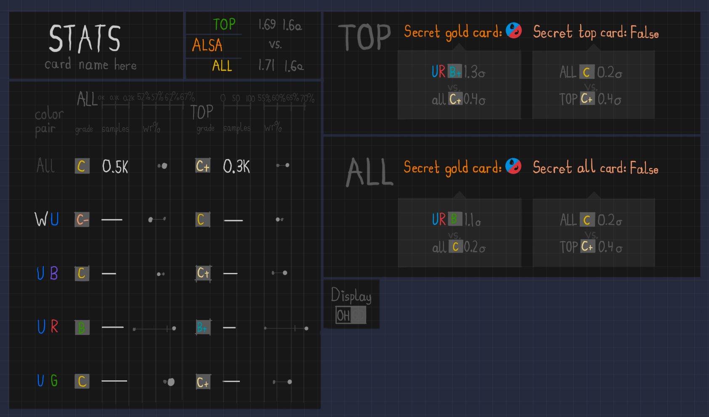

# p5-compareDraftPicks
I've created py-util, which also has a p5-compareDraftPicks. Inside this project, we'll basically be doing the same thing! Except, with data from py-util.  
 
This project is currently in maintenance. UI planning is required.  
 
Single-card popup screen planning, for now. I have a few ideas:  
Small window at the top-left for the STATS header. 
Below that is a table of winrates and grades. There is one row for each color pair, and there are 4 columns, them being ALL OH, ALL GD, TOP OH, and TOP GD. Of course, the ALL and TOP section are spaced out.  
To the right includes all of the findings. For each of GD, OH, and GD+OH, it will say: 
Secret gold card: WU. Performs 1.1σ better than general data in ALL (B+ WU vs. C ALL). Performs 0.1σ better in ALL than TOP in WU (B+ ALL vs. B TOP). 
0.1σ better in TOP than ALL (C TOP vs. C ALL). 
 
Or it will say something like: 
No secret gold card. Best color pair is WB, performs 0.2σ better than general data in ALL (B WB vs. D+ ALL). Performs 0.8σ better in TOP than ALL in WB (A- WB vs. B). 
0.5σ better in TOP than ALL (C- TOP vs. D+ ALL). 
 
This leaves some unused space in the bottom-right...which is definitely not convenient for the card image. 
We can see where to put the card image (or if super inconvenient, the card name) later. 
 
The following is my planning: (Note: This planning has no correct diagrams or examples taken directly from 17lands.)

 
To be fair, I represented secret gold card and secret top card differently than you guys would've expected me to.  
 
The cardname is under the StATS header. Maybe it should be white as well. 