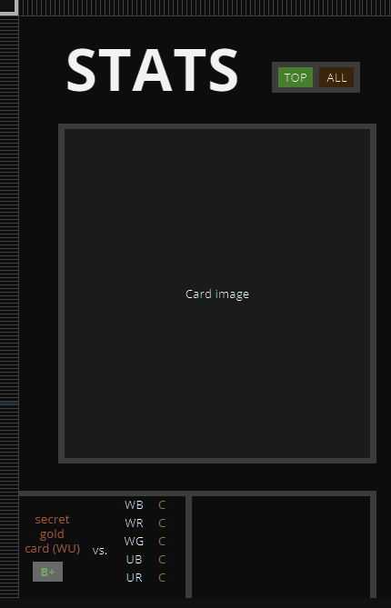
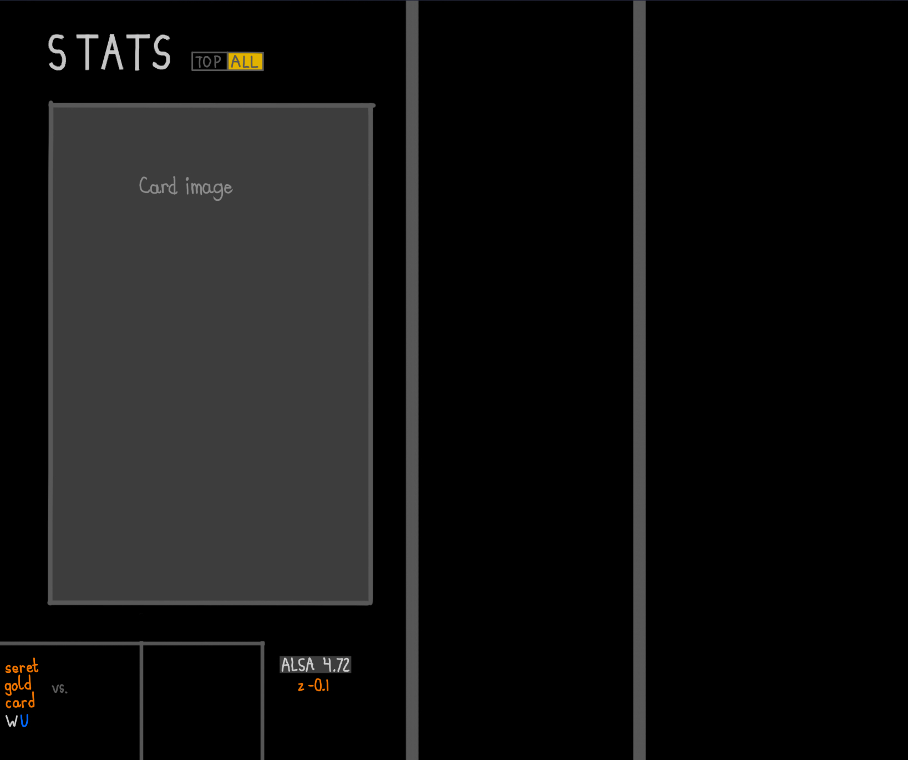

# p5-compareDraftPicks
I've created py-util, which also has a p5-compareDraftPicks. 
Inside this project, we'll basically be doing the same thing! 
Except, with data from py-util.   
This project is currently in maintenance. UI planning is required.   
Single-card popup screen planning, for now. 
This is what part of the canvas should look like, 
from Google Sheets drawings.  

  
According to Procreate it should look something like this:

    
<b>⚠️This isn't finished.⚠️<b>